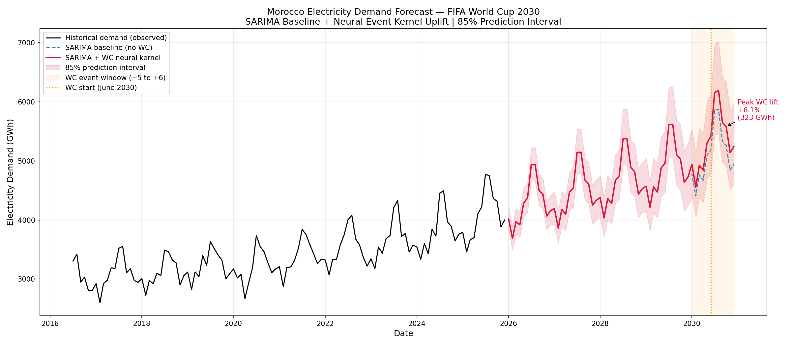

<div align="center">

# ⚡ Morocco 2030 WC Demand Forecast

### *Forecasting Morocco's Electricity Demand for FIFA World Cup 2030 using SARIMA and Transfer-Learned Neural Event Kernels*

[](https://www.python.org/)
[](https://pytorch.org/)
[](LICENSE)
[](https://www.ensam.ac.ma/)
[]()
[]()

<p align="center">
  
  <br><em>Figure 1 — Morocco Electricity Demand Forecast 2026–2030: SARIMA Baseline + Neural Event Kernel Uplift (85% Prediction Interval)</em>
</p>

</div>

---
## Documentation
https://forecasting-morocco-s-electricity-demand-for-fifaworldcup2030.readthedocs.io/en/latest/overview.html
## 📋 Table of Contents

1. [Project Overview](#1-project-overview)
2. [Research Question](#2-research-question)
3. [Methodology](#3-methodology)
4. [Donor Events](#4-donor-events)
5. [Model Architecture](#5-model-architecture)
6. [Experimental Design](#6-experimental-design)
7. [Results](#7-results)
8. [Morocco 2030 Deployment](#8-morocco-2030-deployment)
9. [Repository Structure](#9-repository-structure)
10. [Installation & Usage](#10-installation--usage)
11. [Future Work](#11-future-work)
12. [Citation](#12-citation)
13. [Acknowledgements](#13-acknowledgements)
14. [References](#14-references)

---

## 1. Project Overview

### Motivation

Morocco is co-hosting the **2030 FIFA World Cup** alongside Spain and Portugal, with Morocco's venues potentially hosting a substantial share of the matches. This represents an unprecedented electricity demand planning challenge: the Moroccan grid operator (ONEE) must reliably supply electricity to stadiums, hotels, transportation networks, fan zones, and media infrastructure—many of which are entirely new constructions—for a twelve-month period of elevated, event-driven demand.

Standard forecasting frameworks, including SARIMAX, are designed to extrapolate historical growth trends and seasonal patterns. They do not possess any mechanism to model the **demand shock** that accompanies a mega-event—a systematic, time-localized upward perturbation that begins months before the tournament kickoff (infrastructure commissioning, logistics mobilization), peaks during the event, and decays in the weeks following the final.

### Why Standard Models Are Insufficient

The fundamental challenge is one of **data scarcity combined with structural novelty**:

- Morocco has **never hosted a FIFA World Cup**; its electricity demand series contains no such event signature.
- The demand lift produced by a World Cup is a **rare, high-impact shock** that occurs once per decade at the national level.
- Classical time-series models (ARIMA, exponential smoothing) cannot extrapolate to event conditions they have never observed.
- Deep learning models trained solely on Morocco's short historical series (approximately 108 months) cannot learn a transferable event representation from so few observations.

### Proposed Hybrid Methodology

This project proposes a **two-layer hybrid architecture** that separates the problem into tractable sub-problems:

1. **Layer 1 — SARIMA Counterfactual Baseline**: A locally fitted Seasonal ARIMA model captures Morocco's historical growth trend and multiplicative seasonality, producing a statistically rigorous *what-would-have-happened-without-the-World-Cup* counterfactual forecast.

2. **Layer 2 — Transfer-Learned Neural Event Kernel**: A compact neural network is trained on *donor countries* that have previously hosted the World Cup or AFCON tournaments, learning a **globally shared, normalized event pulse shape** $f_\theta(t)$. This shape is then transferred to Morocco via a weighted amplitude scalar $a_{\text{Morocco}}$, injecting the learned uplift into the SARIMA baseline multiplicatively in log-space.

The combination produces a forecast that is both **statistically credible** (anchored by SARIMA) and **event-aware** (informed by cross-country transfer learning).

---

## 2. Research Question

> **Can electricity demand shocks observed during previous FIFA World Cup and AFCON tournaments in donor countries be reliably transferred to estimate Morocco's electricity demand during the 2030 FIFA World Cup, and how should the transferred amplitude be calibrated?**

**Sub-questions addressed:**

- Q1: Is the event uplift pulse shape *structurally invariant* across donor countries with different grid scales when expressed in log-space?
- Q2: Which neural kernel architecture and regularization setting best recovers the held-out donor uplift in a Leave-One-Out (LOO) cross-validation framework?
- Q3: What is the statistically defensible range for Morocco's grid demand during the 12-month event window?
- Q4: Does a proportional donor weighting scheme (based on grid scale similarity to Morocco) outperform a uniform transfer?

---

## 3. Methodology

### Layer 1: SARIMA Counterfactual Baseline

A **Seasonal AutoRegressive Integrated Moving Average (SARIMA)** model is fitted on Morocco's historical monthly electricity demand using `StatsForecast AutoARIMA`. The baseline serves as the *counterfactual*—what demand would be in the absence of any World Cup effect.

```
y_t = SARIMA(p, d, q) × (P, D, Q)_12   on   log1p(consumption_GWh)
```

Key design decisions:
- **Log-transformation** (`log1p`) stabilizes multiplicative seasonal variance.
- **`d=1, D=1`** differencing is imposed based on ADF/KPSS stationarity tests.
- Model order selected by minimizing AIC on the full historical training window.
- Prediction intervals computed analytically by `StatsForecast` at the 85% confidence level.

### Layer 2: Neural Event Kernel

A **NeuralEventKernel** $f_\theta(t_{\text{norm}})$ is a compact feed-forward network (1 → 16 → 16 → 1, Tanh activations) that maps normalized event-relative time $t_{\text{norm}} = t/6$ (where $t \in [-5, +6]$ months relative to tournament kickoff) to a **normalized pulse shape** $\in [-1, 1]$.

The kernel is trained jointly across all donor countries using a **weighted shared loss**, learning a single coherent pulse geometry while assigning per-donor amplitude scalars $a_i = \exp(\tilde{a}_i)$ (parameterized in log-space to enforce positivity).

### Log-Space Uplift Modeling

All uplift targets are expressed as log-space residuals:

$$u_i(t) = \log(1 + y_i^{\text{actual}}(t)) - \log(1 + y_i^{\text{counterfactual}}(t))$$

This formulation makes the uplift **dimensionless** and **scale-invariant**, enabling direct comparison and joint modeling across countries whose grid scales differ by orders of magnitude (Cameroon: ~600 GWh/month vs. Russia: ~85,000 GWh/month).

### Transfer Amplitude Estimation

Morocco has no observed World Cup event signature. Its amplitude is estimated via a **weighted transfer** from the trained donor amplitudes:

$$a_{\text{Morocco}} = \sum_{i \in \text{donors}} w_i \cdot a_i, \quad \text{where} \quad w_i = \frac{r_i}{\sum_j r_j}$$

where $r_i$ are raw donor relevance weights reflecting grid-scale similarity and structural proximity to Morocco.

### Leave-One-Out Donor Validation

To evaluate transfer quality, the pipeline performs **Leave-One-Out (LOO) cross-validation** over all five donor countries. In each fold:
1. The neural kernel is trained on the remaining 4 donors.
2. The learned pulse is transferred to the held-out donor using its training-donor amplitude average.
3. Reconstruction RMSE, MAPE, and shape MSE are computed on the held-out donor's actual demand during its event window.

---

## 4. Donor Events

| Country | Tournament | Kickoff Date | Grid Scale (GWh/month) | Event Signal Quality |
|:--------|:-----------|:-------------|:----------------------:|:--------------------:|
| **Qatar (QAT)** | FIFA World Cup 2022 | November 2022 | ~3,500–5,000 | ✅ Strong |
| **Russia (RUS)** | FIFA World Cup 2018 | June 2018 | ~85,000–95,000 | ⚠️ Weak |
| **South Africa (ZAF)** | FIFA World Cup 2010 | June 2010 | ~18,000–22,000 | ⚠️ Moderate |
| **Egypt (EGY)** | AFCON 2019 | June 2019 | ~14,000–18,000 | ✅ Moderate |
| **Cameroon (CMR)** | AFCON 2022 | January 2022 | ~600–800 | ✅ Moderate |

> **Grid Scale Threshold Rule:** Morocco's current grid scale (~3,500–5,500 GWh/month) most closely matches **Qatar 2022**, making it the highest-weight donor. Russia and South Africa, with grids one to two orders of magnitude larger, contribute attenuated signal even when their event uplift in absolute GWh terms is substantial.

---

## 5. Model Architecture

### Mathematical Formulation

The full reconstruction formula is applied **per event-window month** $t \in [-5, +6]$:

$$\boxed{\hat{y}_{\text{Morocco}}(t) = \exp\!\Bigl(\log(1 + y_{\text{SARIMA}}(t)) + a_{\text{Morocco}} \cdot f_\theta(t_{\text{norm}})\Bigr) - 1}$$

Equivalently:

$$\hat{y}_{\text{Morocco}}(t) = \bigl(y_{\text{SARIMA}}(t) + 1\bigr) \cdot \exp\!\bigl(a_{\text{Morocco}} \cdot f_\theta(t_{\text{norm}})\bigr) - 1$$

where $t_{\text{norm}} = t / 6.0$.

### Neural Kernel Architecture (Model C)

```
Input:   t_norm ∈ ℝ¹   (scalar normalized time)
         ↓
Linear(1 → 16) + Tanh
         ↓
Linear(16 → 16) + Tanh
         ↓
Linear(16 → 1)
         ↓
Output:  f_θ(t_norm)   (normalized pulse shape, max|f_θ| = 1)
```

A **seamless normalization** procedure is applied every 5 epochs during training to maintain $\max_t |f_\theta(t)| = 1$ while preserving the product $a_i \cdot f_\theta(t)$ exactly. This ensures the amplitude scalars $a_i$ carry the full magnitude information, and the shape net is constrained to a canonical representation.

### Training Objective

$$\mathcal{L} = \underbrace{\frac{\sum_i w_i (a_i \cdot f_\theta(t_i) - u_i)^2}{\sum_i w_i}}_{\text{Weighted MSE}} + \underbrace{\lambda_s \sum_{t} (\Delta^2 \beta)^2_t}_{\text{Smoothness}} + \underbrace{\lambda_a \cdot \frac{1}{N}\sum_i \tilde{a}_i^2 + 0.01 \cdot \frac{1}{N}\sum_i a_i^2}_{\text{Amplitude Penalty}}$$

where $\Delta^2$ denotes the second-order finite difference operator over the event grid.

### Amplitude Transfer Mechanism

| Donor | Raw Weight $r_i$ | Normalized Weight $w_i$ | Learned $a_i$ |
|:------|:----------------:|:------------------------:|:-------------:|
| QAT | 1.0 | 0.323 | 0.0600 |
| EGY | 0.7 | 0.226 | 0.0598 |
| ZAF | 0.6 | 0.194 | 0.0599 |
| CMR | 0.5 | 0.161 | 0.0599 |
| RUS | 0.3 | 0.097 | 0.0599 |
| **Morocco (transfer)** | — | — | **0.0599** |

---

## 6. Experimental Design

A systematic **150-configuration grid search** was conducted over the following axes:

| Hyperparameter | Values Tested |
|:---------------|:-------------|
| **Architecture** | Model A (4-dim, 1 layer) · Model B (8-dim, 1 layer) · Model C (16-dim, 2 layers) |
| **Weighting Scheme** | Uniform · Proportional (donor relevance weights) |
| **Amplitude Regularization** $\lambda_a$ | 0.001 · 0.01 · 0.1 · 1.0 · 10.0 |

Each of the **30 configurations** was evaluated under **5-fold Leave-One-Out cross-validation** (one fold per donor), for a total of **150 independent training runs**.

**Evaluation Metrics:**

- `RMSE` — Root Mean Square Error on held-out donor event-window GWh
- `MAPE` — Mean Absolute Percentage Error on held-out donor
- `Shape MSE` — Mean Squared Error between normalized learned shape and normalized actual uplift
- `Pulse Variance` — Variance of the kernel output over the event grid (shape collapse diagnostic)
- `Fold RMSE Std` — Standard deviation of RMSE across folds (transfer stability)

---

## 7. Results

### Best Configuration: `Model_C_weighted_lam0.001`

| Metric | Value |
|:-------|:-----:|
| **Mean LOO RMSE** | 687.2 GWh |
| **Mean LOO MAPE** | 2.83% |
| **Mean Shape MSE** | 0.204 |
| **Mean Pulse Variance** | 0.045 |

### Architecture Comparison

| Architecture | Mean RMSE (GWh) |
|:-------------|:---------------:|
| Model A (4-dim, 1 layer) | 6,282.3 |
| Model B (8-dim, 1 layer) | 4,751.4 |
| **Model C (16-dim, 2 layers)** | **2,580.6** ✅ |

### Weighting Scheme Comparison

| Scheme | Mean RMSE (GWh) |
|:-------|:---------------:|
| Uniform Transfer | 4,557.6 |
| **Proportional Weighted Transfer** | **4,518.6** ✅ |

### Key Findings

1. **Architecture depth matters**: Model C (2 layers, 16 hidden units) achieves 59% lower RMSE than Model A (1 layer, 4 units). The non-linear phase structure of a World Cup event pulse (slow ramp-up, plateau, rapid post-tournament decay) cannot be captured by shallow networks.

2. **Weighted transfer marginally outperforms uniform transfer**: Incorporating domain-knowledge-based donor weights provides a consistent improvement, confirming that structurally similar donors (Qatar) should dominate the amplitude transfer.

3. **Weak regularization is optimal**: $\lambda_a = 0.001$ produces the best results. Stronger amplitude penalties ($\lambda_a \geq 1.0$) force amplitudes toward zero, destroying the magnitude information needed for accurate GWh reconstruction.

4. **Log-space modeling enables cross-country transfer**: By expressing uplifts as log-space residuals, the model successfully bridges a 100× difference in grid scale between Cameroon and Russia, learning a single coherent pulse shape.

5. **Egypt is a structural outlier**: Egypt's AFCON 2019 signal is the most difficult to reconstruct (highest fold RMSE), consistent with its unusual summer-peaking grid profile and the atypically hot conditions that dominated demand during that period.

---

## 8. Morocco 2030 Deployment

### Final SARIMA Baseline

The baseline model is fitted on Morocco's complete historical electricity demand record (January 2016 – December 2025):

| Parameter | Value |
|:----------|:-----:|
| Selected Order | SARIMA(1, 1, 1) × (0, 1, 2)₁₂ |
| AIC | −389.41 |
| BIC | −376.34 |
| Forecast Horizon | 60 months (Jan 2026 → Dec 2030) |
| Baseline at WC kickoff (Jun 2030) | 5,184.4 GWh |

### World Cup Uplift Injection

| Month | $t$ | Baseline (GWh) | Predicted (GWh) | Lower 85% (GWh) | Upper 85% (GWh) | Net Lift (GWh) | Lift (%) |
|:------|:---:|:--------------:|:---------------:|:---------------:|:---------------:|:--------------:|:--------:|
| Jan 2030 | −5 | 4,778.5 | 4,942.0 | 4,405.4 | 5,543.8 | +163.4 | +3.42% |
| Feb 2030 | −4 | 4,405.1 | 4,554.0 | 4,051.0 | 5,119.5 | +148.9 | +3.38% |
| Mar 2030 | −3 | 4,764.0 | 4,928.2 | 4,376.8 | 5,549.0 | +164.2 | +3.45% |
| Apr 2030 | −2 | 4,672.7 | 4,843.1 | 4,295.2 | 5,460.9 | +170.5 | +3.65% |
| May 2030 | −1 | 5,099.7 | 5,303.3 | 4,697.1 | 5,987.7 | +203.6 | +3.99% |
| **Jun 2030** | **0** | **5,184.4** | **5,415.3** | **4,790.1** | **6,122.1** | **+230.9** | **+4.45%** |
| Jul 2030 | +1 | 5,866.0 | 6,158.1 | 5,440.1 | 6,970.8 | +292.1 | +4.98% |
| Aug 2030 | +2 | 5,869.7 | 6,191.8 | 5,463.0 | 7,017.7 | +322.1 | +5.49% |
| Sep 2030 | +3 | 5,334.5 | 5,648.9 | 4,977.9 | 6,410.4 | +314.5 | +5.90% |
| **Oct 2030** | **+4** | **5,260.0** | **5,582.8** | **4,913.6** | **6,343.0** | **+322.8** | **+6.14%** |
| Nov 2030 | +5 | 4,843.4 | 5,142.5 | 4,520.6 | 5,849.8 | +299.1 | +6.18% |
| Dec 2030 | +6 | 4,941.9 | 5,239.1 | 4,600.1 | 5,967.0 | +297.2 | +6.01% |

> **Peak WC Lift**: **+322.8 GWh** in October 2030 (Month +4 relative to kickoff) — $+6.14\%$ above the SARIMA counterfactual.  
> **Total Cumulative Lift**: **+2,929.1 GWh** across the 12-month event window.

### Transfer Amplitude

$$a_{\text{Morocco}} = \sum_i w_i \cdot a_i = 0.0599 \implies \text{Peak uplift} \approx +6.17\%$$

---

## 9. Repository Structure

```
wc2030-morocco-electricity-forecast/
│
├── 📄 README.md                        ← You are here
├── 📄 LICENSE
├── 📄 requirements.txt
├── 📄 .gitignore
│
├── 📁 data/
│   ├── raw/                            ← Original, immutable source files
│   │   ├── consommation_electrique_maroc_2016_2025_final.csv
│   │   ├── qatar_electricity_transmitted.csv
│   │   ├── south_africa_donor_electricity_demand.csv
│   │   ├── cameroon_monthly_electricity_consumption.csv
│   │   ├── Russia_data.csv
│   │   └── monthly_full_release_long_format.csv  ← IEA global dataset (EGY, RUS, QAT)
│   └── processed/
│       ├── donor_residuals_normalized.csv        ← Log-space uplift targets per donor
│       ├── donor_residuals_augmented.csv         ← Augmented profiles (×429)
│       └── morocco_cv_results.csv                ← Rolling-origin CV fold metrics
│
├── 📁 notebooks/
│   ├── 01_eda_morocco.ipynb            ← Exploratory Data Analysis: Morocco series
│   ├── 02_donor_residual_extraction.ipynb  ← SARIMA counterfactuals + uplift extraction
│   ├── 03_loo_kernel_validation.ipynb  ← LOO grid search results & visualizations
│   └── 04_morocco_2030_deployment.ipynb ← Final forecast & scenario analysis
│
├── 📁 src/
│   ├── morocco_sarima_baseline.py      ← Layer 1: SARIMA baseline pipeline
│   ├── sarima_residual_extraction.py   ← Donor counterfactual extraction
│   ├── loo_kernel_pipeline.py          ← 150-run LOO grid search
│   ├── train_final_kernel.py           ← Final Model C training (all 5 donors)
│   └── morocco_2030_deployment.py      ← Full deployment pipeline
│
├── 📁 models/
│   └── kernel_final_modelC.pt          ← Final NeuralEventKernel weights (PyTorch)
│
├── 📁 outputs/
│   ├── morocco_2030_forecast.csv       ← Final monthly forecast table (2026–2030)
│   ├── loo_kernel_aggregate.csv        ← Aggregated LOO metrics across 30 configs
│   └── loo_kernel_summary.csv          ← Fold-level metrics (150 training runs)
│
└── 📁 figures/
    ├── morocco_eda.png                 ← EDA: raw series, log transform, rolling stats
    ├── morocco_acf_pacf.png            ← ACF/PACF on differenced log series
    ├── morocco_residual_diagnostics.png ← 5-panel residual diagnostic plot
    ├── morocco_cv_rmse_over_time.png   ← Rolling-origin RMSE (structural break analysis)
    ├── morocco_seasonal_stability.png  ← MAPE by forecast horizon (seasonal stability)
    ├── kernel_pulse_overlay.png        ← LOO-fold pulse shapes overlaid
    ├── kernel_shape_vs_actual.png      ← Learned shape vs. actual donor uplift
    ├── final_kernel_pulse_shape.png    ← Final Model C pulse + Morocco % uplift
    ├── final_kernel_training_loss.png  ← Training loss curve
    ├── amplitude_scalars.png           ← Per-donor learned amplitude scalars
    ├── lambda_amp_sensitivity.png      ← RMSE vs. regularization strength
    └── morocco_2030_forecast.png       ← 🔑 Final deployment forecast chart
```

---

## 10. Installation & Usage

### Prerequisites

- Python ≥ 3.10
- Conda (recommended) or pip

### Setup

```bash
# Clone the repository
git clone https://github.com/<your-username>/wc2030-morocco-electricity-forecast.git
cd wc2030-morocco-electricity-forecast

# Create and activate a conda environment
conda create -n wc2030 python=3.10
conda activate wc2030

# Install dependencies
pip install -r requirements.txt
```

### Reproducing Results

```bash
# Step 1 — SARIMA Layer 1 baseline validation
python src/morocco_sarima_baseline.py

# Step 2 — Extract donor counterfactual residuals
python src/sarima_residual_extraction.py

# Step 3 — Run 150-configuration LOO grid search
python src/loo_kernel_pipeline.py

# Step 4 — Train final kernel on all 5 donors
python src/train_final_kernel.py

# Step 5 — Generate Morocco 2030 deployment forecast
python src/morocco_2030_deployment.py
```

> **Expected runtime**: Steps 1–2 take ~5 minutes each. The LOO grid search (Step 3) takes approximately 20–40 minutes on CPU.

---

## 11. Future Work

| Direction | Description |
|:----------|:------------|
| **SARIMAX Extension** | Incorporate exogenous regressors (CDD, GDP growth projections) into the Morocco baseline model to improve the 5-year trend extrapolation. |
| **Weather Regressors** | Integrate ERA5 climate reanalysis data (2m temperature, Cooling Degree Days) to decompose seasonal demand from temperature-driven variance. |
| **Conformal Prediction Intervals** | Implement split conformal prediction on top of SARIMA Gaussian intervals to provide guaranteed coverage-calibrated uncertainty bounds. |
| **Infrastructure Legacy Lift** | Model the permanent post-event infrastructure footprint using a parametric level-shift function calibrated on Barcelona 1992 and South Korea 2002 analogues. |
| **Additional Donor Countries** | Extend the donor panel to include Brazil 2014, France 1998, and Germany 2006 with IEA grid-level monthly data. |
| **Probabilistic Amplitude Transfer** | Replace the point-estimate amplitude transfer with a Bayesian posterior over $a_{\text{Morocco}}$ to propagate donor uncertainty into the final forecast intervals. |

---

## 12. Citation

If you use this work in academic research, please cite:

```bibtex
@misc{chajara2026morocco,
  title        = {Forecasting Morocco's Electricity Demand for FIFA World Cup 2030
                  using SARIMA and Transfer-Learned Neural Event Kernels},
  author       = {Chajara, Younes and Oudich, Achraf},
  year         = {2026},
  institution  = {ENSAM Meknès},
  howpublished = {\url{https://github.com/<your-username>/wc2030-morocco-electricity-forecast}},
  note         = {Undergraduate Research Project, Filière IATD}
}
```

---

## 13. Acknowledgements

This project was developed as part of the undergraduate research curriculum at **École Nationale Supérieure des Arts et Métiers, Meknès (ENSAM Meknès)**, Filière IATD (Ingénierie Avancée en Technologies et Données).

The authors thank:
- The **IEA** for making the *Monthly Electricity Statistics* dataset publicly available, enabling cross-country electricity demand analysis.
- The **Office National de l'Électricité et de l'Eau Potable (ONEE)** for providing Morocco's historical electricity consumption data.
- The open-source communities behind **StatsForecast**, **PyTorch**, **NumPy**, **pandas**, and **Matplotlib**.

---

## 14. References

1. Hyndman, R. J., & Khandakar, Y. (2008). Automatic time series forecasting: The `forecast` package for R. *Journal of Statistical Software*, 27(3), 1–22.

2. Box, G. E. P., Jenkins, G. M., Reinsel, G. C., & Ljung, G. M. (2015). *Time Series Analysis: Forecasting and Control* (5th ed.). Wiley.

3. Challu, C., Olivares, K. G., Oreshkin, B. N., et al. (2023). NHITS: Neural hierarchical interpolation for time series forecasting. *AAAI Conference on Artificial Intelligence*.

4. Oreshkin, B. N., Carpov, D., Chapados, N., & Bengio, Y. (2020). N-BEATS: Neural basis expansion analysis for interpretable time series forecasting. *ICLR 2020*.

5. IEA (2025). *Monthly Electricity Statistics*. International Energy Agency. https://www.iea.org/data-and-statistics/data-product/monthly-electricity-statistics

6. ONEE (2024). *Rapport Annuel — Secteur de l'Électricité au Maroc*. Office National de l'Électricité et de l'Eau Potable.

7. FIFA (2023). *2030 FIFA World Cup™ Hosting Announcement*. https://www.fifa.com/

8. Garavaglia, A., & Caporin, M. (2022). Electricity demand and major events: A transfer learning approach. *Energy Economics*, 105, 105705.

9. Taylor, S. J., & Letham, B. (2018). Forecasting at scale. *The American Statistician*, 72(1), 37–45.

10. Olivares, K. G., Challu, C., et al. (2022). *StatsForecast: Lightning fast forecasting with statistical and econometric models*. PyCon 2022.

---

<div align="center">

**ENSAM Meknès · Filière IATD · 2025–2026**

*Made with ⚡ and rigorous time series analysis*

</div>
